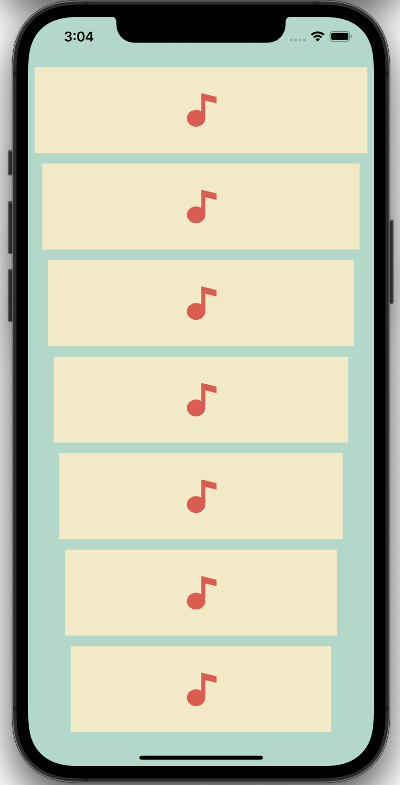
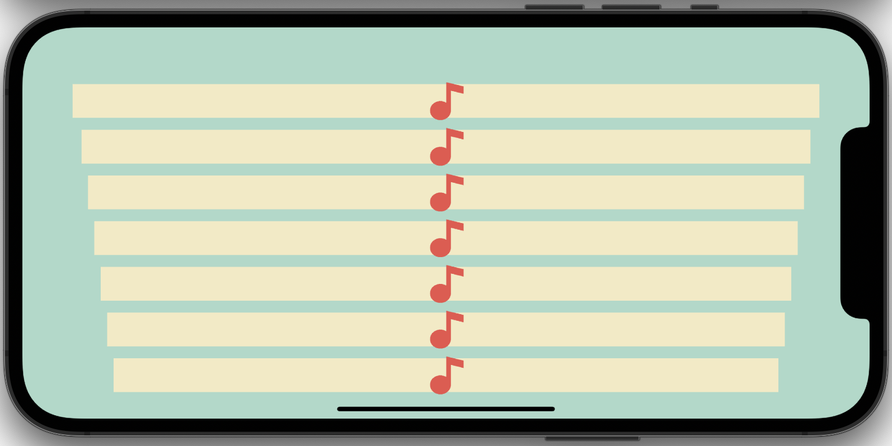

# Xylo 

Xylo is a minimalist xylophone app built for iphone and ipad in swift. An exciting
app developed for everyone, Especially children!

* **Play** different keynotes.
* **Works** both in portrait and landscape mode.
* **Includes** icon set for iphone and ipad.

## Technologies used in this project:

 

---

Use **iphone** of any screen size to play your notes.

  

  

